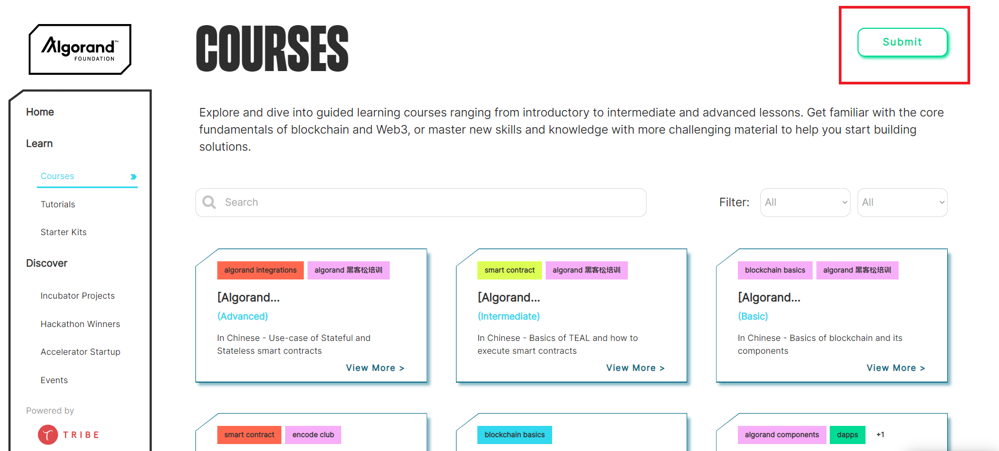
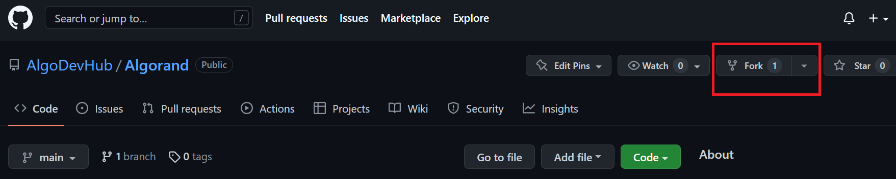
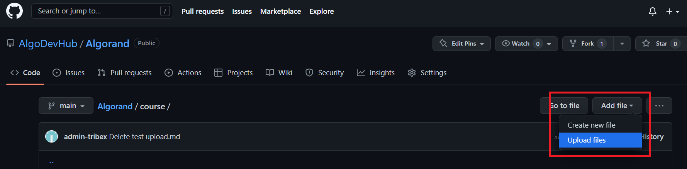
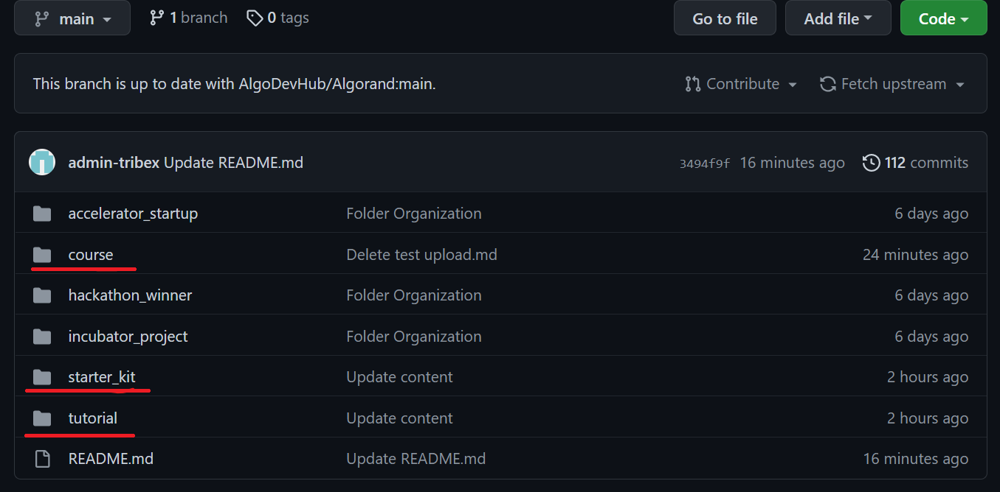
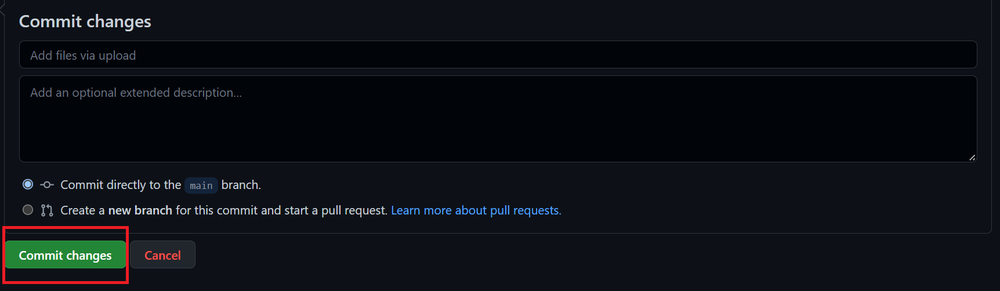
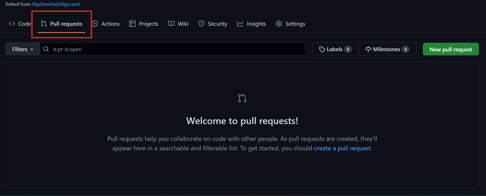
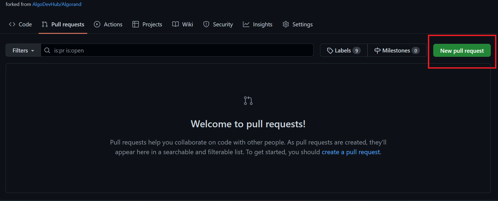
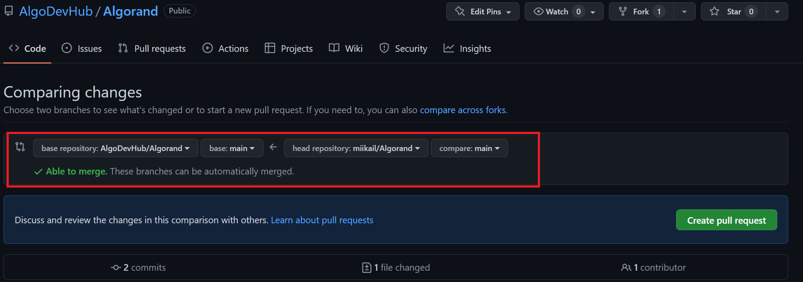
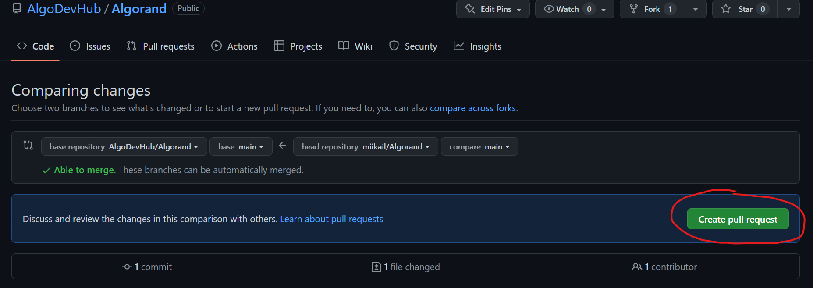

# You can add in new materials by following these steps:

1. ### In AlgoDev Hub, click on the **"submit"** button on the top right-hand corner, it will redirect you to the GitHub repo
    \
    

---
2. ### When in GitHub, you will first need to fork the repo, creating another version just for you
\
    

---
3. ### Go to the folder according to your material, whether it is course, tutorial or starter kit, then click on **"add files"** to upload your contents
    \
    
   
   
    - templates for file uploading should be as followed:\
    \
     \---\
     title: "(Title of content)"\
     description: "(Short description of content)"\
     type: "(Type of content (course/tutorial/starter-kit))"\
     category: "(tag 1, tag 2, tag n)"\
     difficulty: "(Level of Difficulty (Basic/Intermediate/Advance))"\
     summary: "(Summary)"\
     file_path: "(Redirect link (If content is hosted on an external platform e.g. Youtube, etc.))"\
     image: "https://assets-global.website-files.com/5e39e095596498a8b9624af1/5ffca6e3e0d8ad9231cc2af6_Portfolio-course---final.png"\
     link: "(URL (of existing content))"\
     status: "open"\
     \---
     
    - ### **It is important to follow the naming accordingly for the type of content and the difficulty of content**
    \
        

---
4. ### Commit the changes
    \
    

---
5. ### Press the **"pull request"** tab
    \
    
    
---
6. ### Create a new pull request
    \
    

---
7. ### Take note that the base repository should be the repo from AlgoDev Hub and head repository should be the repository you just forked
    \
    

---
8. ### Create the pull request
    \
    

---
9. ### Wait for admin to verify the request

