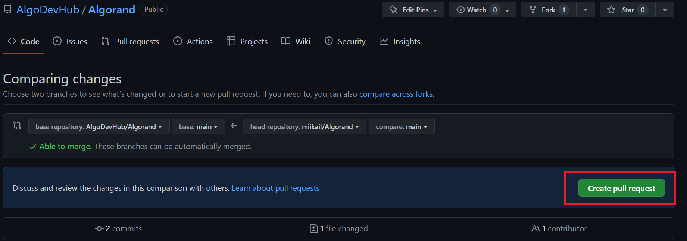

# You can submit new materials to be added into AlgoDev Hub by following these steps:

1. ### In AlgoDev Hub, click on the **"submit"** button on the top right-hand corner, it will redirect you to the GitHub repo
    \
    

---
2. ### When in GitHub, you will first need to fork the repo, creating another version just for you
\
    

---
3. ### Go to the folder according to your material, whether it is course, tutorial or starter kit, then click on **"add files"** to upload your materials 
    \
    
    
    
   
   
    - ### Templates for file uploading should be as followed:
         \---\
         title: "(Title of content)"\
         description: "(Short description of content)"\
         type: "(Type of content (course/tutorial/starter-kit))"\
         category: "(tag 1, tag 2, tag n)"\
         difficulty: "(Level of Difficulty (Basic/Intermediate/Advanced))"\
         summary: "(Summary)"\
         file_path: "(Redirect link (If content is hosted on an external platform e.g. Youtube, etc.))"\
         image: "https://assets-global.website-files.com/5e39e095596498a8b9624af1/5ffca6e3e0d8ad9231cc2af6_Portfolio-course---final.png"\
         link: "(URL (of existing content))"\
         status: "open"\
         \---
     
    - ### **It is important to follow the naming accordingly for the type of content and the difficulty of content**
    
        The following forms a guideline on how content is categorised on the Algo Dev Hub platform. Future content that is added should be tagged and categorised based on the following guideline: 

        - **Categories**

            - **course**:\
                Lecture notes, presentations that provides information on a topic\
                Each series of courses should also be tagged with their Course Names (e.g. Algorand Protocol Course) so that readers can easily find the full series of content under each Course.  

            - **tutorial**:\
                Exercises and examples for one to practice certain topics.\
                Documentations  

            - **starter-kit**:\
                A curated list of introductory materials to get started on understanding the Algorand ecosystem \ 
            ---
 
        - **Level of Difficulty**
            - Basic – Introduction to the Algorand infrastructure and protocol 
            - Intermediate – For developers looking to get started with Algorand and blockchain development 
            - Advanced – For developers who are already familiar with Algorand’s basic components and structure, looking to explore more of its applications in depth 
            ---
 

        - **Content Pillars – Tags**\
            Each content is tagged under each Content Pillar, so that a user can easily search for an extensive list of content available under each topic.  
            - Blockchain Basics 
            - Smart Contract 
            - dApps 
            - Gaming 
            - Algorand Basics 
            - ASA 
            - Governance 
            - Sustainability 
            - Algorand Components 
            - PyTeal 
            - NFT 
            - Others 
            - Algorand Integrations 
            - Algorand Wallet 
            - DeFi 
            ---
        

        - **Summary of Content** 

            - Provide a summary in 70-100 words in 1-2 paragraphs. The summary should include:  
                - What the content is about  
                - Who is the target audience 
                - What can be achieved / outcome after going through the content 
                
---
4. ### Commit the changes
    \
    

---
5. ### Press the **"pull request"** tab
    \
    
    
---
6. ### Create a new pull request
    \
    

---
7. ### Take note that the base repository should be the repo from AlgoDev Hub and head repository should be the repository you just forked
    \
    

---
8. ### Create the pull request
    \
    

---
9. ### Requests to add content should be reviewed within 3 working days from the time of submission. 

